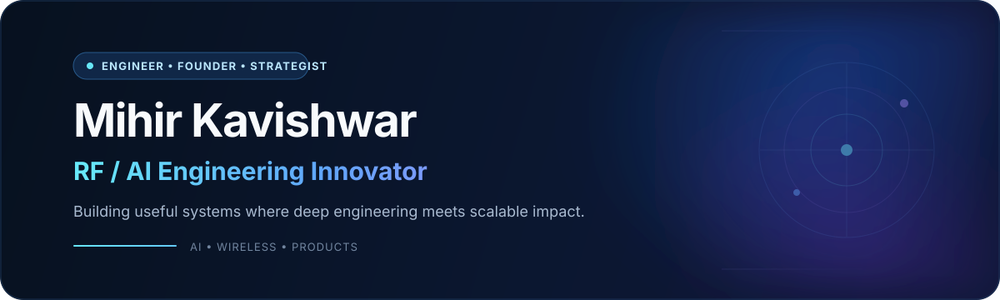
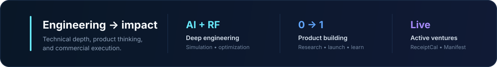

<!-- GitHub Profile README for @mihirkavi. Visual direction mirrors mihirkavishwar.com. -->

  
   
  &nbsp;
  &nbsp;
  &nbsp;
  

 

 

## About

I’m a founder and engineer focused on **technology commercialization across AI, Web3, and wireless communication**. I bring scientific problem-solving and technical standards into practical product and customer work.

By day, I’m a **Technical Account Manager / Application Engineer at MathWorks**. Before that, I spent four years as a software engineer building antenna and RF design applications in MATLAB, and I studied Engineering Management at **USC**. Alongside that role, I build independent products spanning nutrition, AI workspaces, and communication.

| | |
|:--|:--|
| **CURRENTLY** | Technical Account Manager / Application Engineer at MathWorks |
| **BUILDING** | ReceiptCal · Manifest · Open Media |
| **PREVIOUSLY** | Software engineer on MathWorks antenna and RF tools, 2018–2022 |
| **WRITING** | Quantum, AI, and emerging technology at [mihirkavishwar.com](https://www.mihirkavishwar.com/blogs) |
| **OPEN TO** | Ventures, collaboration, and investment conversations |

 

## Ventures

| Venture | Focus | Stage |
|:--|:--|:--:|
| **[ReceiptCal](https://receiptcal.com)** | Private, lower-friction nutrition tracking from supported digital food receipts, with reviewable estimates. | `LIVE` |
| **[Manifest](https://manifeststartup.com/home)** | AI-assisted workspace for idea validation, connected startup documents, and investor collaboration. | `BUILDING` |
| **[Open Media](https://github.com/mihirkavi/open-media)** | Cross-platform social and messaging system with transparent feeds and explicit provider capabilities. | `PRIVATE BETA` |

**Explore the work** &nbsp;→&nbsp; [ReceiptCal](https://www.mihirkavishwar.com/work/receiptcal) · [Open Media](https://www.mihirkavishwar.com/work/open-media) · [Antenna Design](https://www.mihirkavishwar.com/work/antenna-design) · [All Projects](https://www.mihirkavishwar.com/work)

 

## Tech & Tools

  <b>LANGUAGES · ML · DATA</b>  
  
    
  <b>TOOLS · PLATFORMS</b>  
  
    
  <b>MATHWORKS · RF · WIRELESS</b>  
  
  
  
  
  

 

## MathWorks Engineering Work

### AI-based Antenna Optimization

Integrated a surrogate-model AI routine into MATLAB, cutting antenna optimization time by **70%**. 
`AI/ML` `MATLAB` `RF OPTIMIZATION` · **[View project →](https://www.mathworks.com/help/antenna/ug/maximizing-gain-and-improving-impedance-bandwidth-of-e-patch-antenna.html)**

### Genetic Algorithm Patch Miniaturization

Designed a GA-driven application for large enterprise clients, **halving** the required antenna footprint. 
`GENETIC ALGORITHMS` `ANTENNA DESIGN` · **[View project →](https://www.mathworks.com/help/antenna/ug/miniaturize-rectangular-microstrip-patch-antenna-using-genetic-algorithm.html)**

### 5G Array Simulation for MIMO & ESA

Built a drag-and-drop GUI for phased-array design, enabling a **50% faster** production workflow. 
`5G` `MIMO` `GUI DEVELOPMENT` · **[View project →](https://www.mathworks.com/help/antenna/gs/design-and-analysis-using-antenna-array-designer-app.html)**

### Antenna Designer — Legacy Refactor

Restructured the application around MVC and SOLID principles for **70% memory and execution gains**. 
`ARCHITECTURE` `MVC` `PERFORMANCE` · **[View project →](https://www.mathworks.com/help/antenna/gs/antenna-design-and-analysis-using-antenna-designer-app.html)**

 

## From the Blog

Essays on engineering and emerging technology. **[Explore the full archive →](https://www.mihirkavishwar.com/blogs)**

| Essay | Published |
|:--|--:|
| [Why Quantum Computers Will Power the AI Era?](https://www.mihirkavishwar.com/blog/posts/quantum-computers-next-computing-champion) | Feb 2026 |
| [Quantum Computing 1: Breaking Down the Process](https://www.mihirkavishwar.com/blog/posts/quantum-computing) | Mar 2024 |
| [AI for Legacy Code](https://www.mihirkavishwar.com/blog/posts/ai-legacy-code) | Jan 2024 |
| [AI, Blockchain & Construction](https://www.mihirkavishwar.com/blog/posts/ai-blockchain-construction) | Jan 2024 |
| [Combatting Deepfakes](https://www.mihirkavishwar.com/blog/posts/combatting-deepfakes) | Jan 2024 |

 

## GitHub Activity

The activity cards previously shown here depended on rate-limited third-party services. GitHub already presents the authoritative contribution history directly below this profile README, so this section links to the source instead of risking broken embeds.

  &nbsp;
  

 

---

  <h3>Let’s build something useful.</h3>
  
Exploring AI, Web3, wireless systems, or an ambitious technical product?

  
    
  Designed to match <a href="https://www.mihirkavishwar.com">mihirkavishwar.com</a> · © Mihir Kavishwar

<!-- No license file is included. This README grants no additional reuse or redistribution permissions. -->